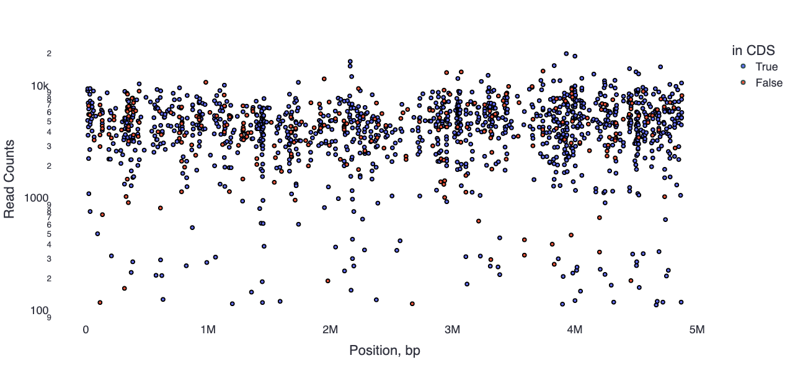
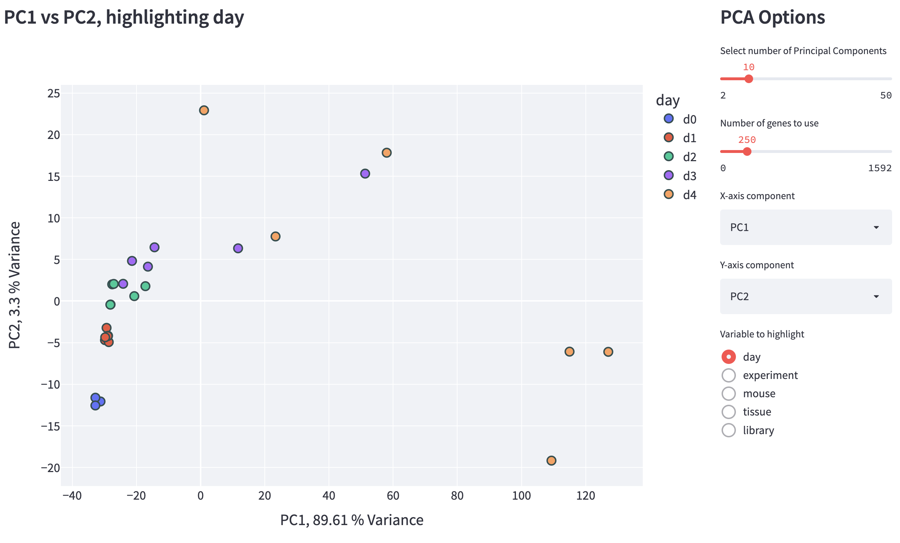
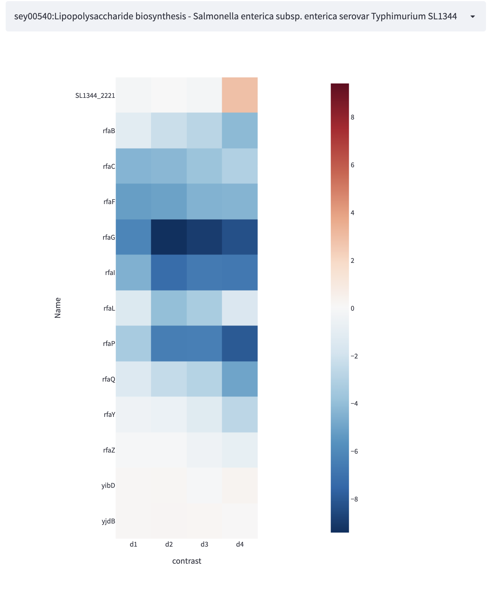

# Explore

[mBARq Web App](https://microbiomics.io/tools/mbarq-app/) allows quick and easy interactive exploration of your BarSeq experiment. 

## Visualise barcode positions across the genome

## Explore interactive PCA plots to look for patterns and outliers

## Generate log fold change heatmaps for a pathway of interest

## and more!

- Explore barcode/gene abundances across conditions
- Get [STRING](https://string-db.org/) interaction network for your hits
- Compare hits between different libraries

## Do you have other ideas/requests? 

- Open an issue [here](https://github.com/ASintsova/mbarq_app)
