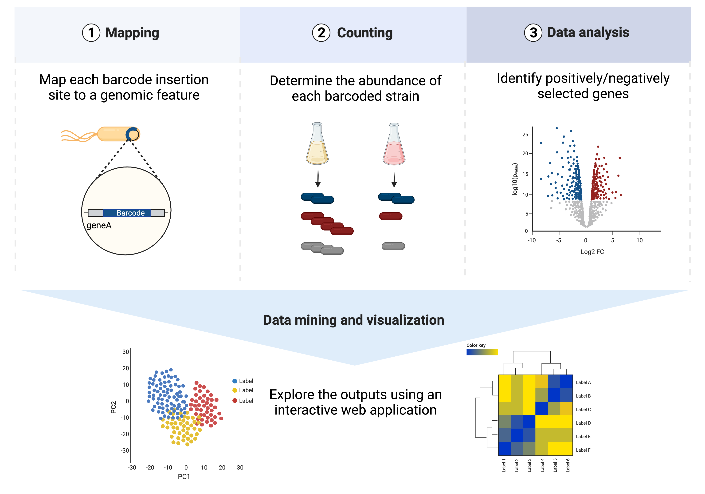

.. mbarq documentation master file, created by
   sphinx-quickstart on Thu Jun 16 11:33:27 2022.
   You can adapt this file completely to your liking, but it should at least
   contain the root `toctree` directive.

Welcome to mBARq's documentation!
=================================

Transposon mutagenesis is a powerful technique that allows the identification of bacterial fitness factors under different environmental conditions. Recently, several studies have used  barcoded transposon mutant libraries to increase the throughput of the experiments. mBARq allows easy processing and analysis of barcoded mutant libraries for any transposon construct (Tn5, *mariner*, *etc*).

Workflow
^^^^^^^^

The main steps of the workflow involve:

1. Mapping of each barcode to the insertion location in the genome.
2. Profiling barcode abundances across samples.
3. Mutant fitness analyses.
4. Exploratory analysis using `mBARq web app`_

.. _mBARq web app: https://mbarq-app.herokuapp.com/

.. include:: install.md
   :parser: myst_parser.sphinx_

Quick Start
^^^^^^^^^^^

- Map each barcode to insertion location in the genome

.. code-block::

   mbarq map -f <library_R1.fastq.gz> -g <host.fasta> -a <host.gff> -l 100 \
   -n LibraryName -tn B17N13GTGTATAAGAGACAG

- Profile barcode abundances for each sample

.. code-block::

   mbarq count  -f <sample.fastq.gz> -m <library_mapping_file.csv> \
   -n ExperimentName -tn B17N13GTGTATAAGAGACAG

- Merge barcode counts from multiple samples into the final table

.. code-block::

   mbarq merge -d <directory_with_count_files> -a locus_tag -n ExperimentName -o .

- Identify enriched/depleted genes between treatments and control

.. code-block::

   mbarq analyze -i <count_file> -s <sample_data_file> -c <control_file> --treatment_column treatment \
   --batch_column batch --baseline control

.. toctree::
   :maxdepth: 1
   :caption: User Guide:

   mapping
   counting
   analysis
   explore

.. toctree::
   :maxdepth: 1
   :caption: Walkthroughs:

   salmonella
   mariner

.. toctree::
   :maxdepth: 1
   :caption: Documentation:

   mbarq

Indices and tables
==================

* :ref:`genindex`
* :ref:`modindex`
* :ref:`search`
